# Maquettes MediBet

Maquettes statiques des 12 écrans principaux de MediBet, au même style visuel
que `medibet.html` (thème sombre, doré, polices Monoton / IBM Plex). Chaque
écran existe en HTML autonome (à ouvrir directement dans un navigateur, ou à
utiliser comme référence pour recréer les écrans dans Figma) et en capture
PNG ci-dessous.

## 1. Accueil — choix du rôle
[`00-accueil.html`](00-accueil.html)
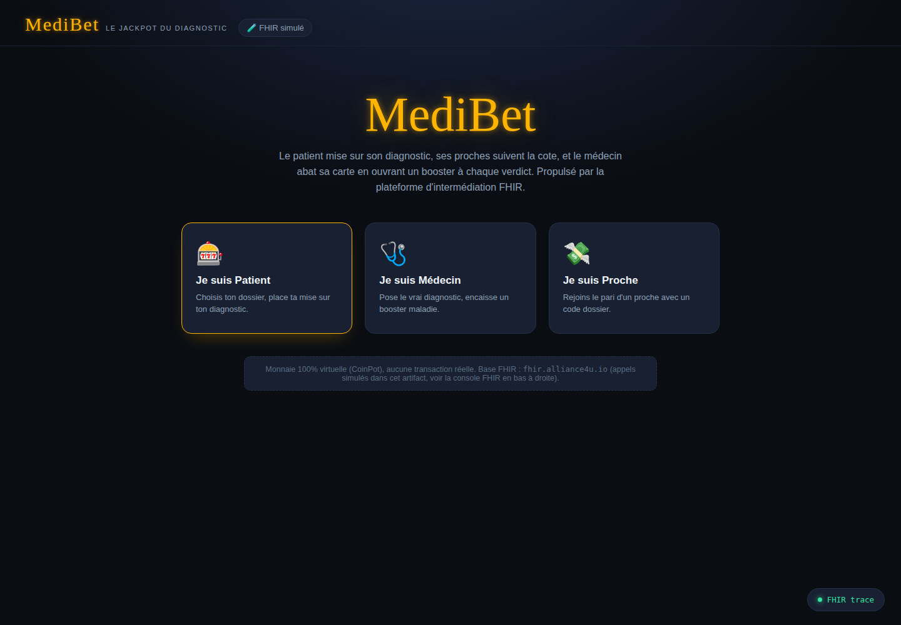

## 2. Patient — mes dossiers
[`01-patient-mes-dossiers.html`](01-patient-mes-dossiers.html)
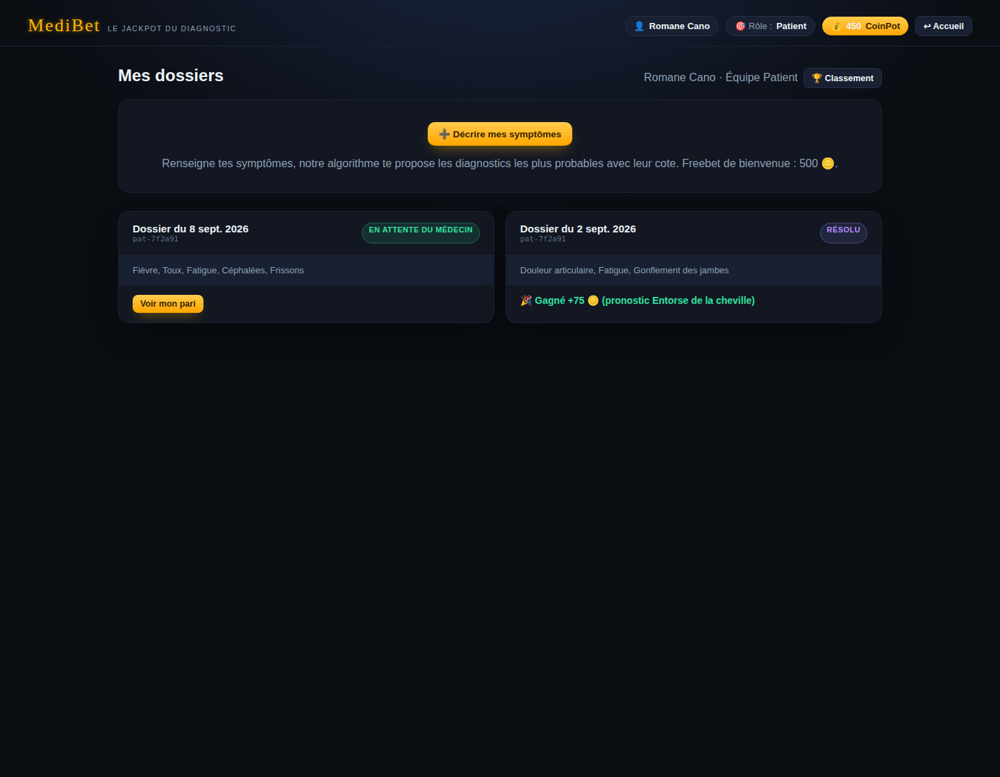

## 3. Patient — choix des symptômes
[`02-patient-symptomes.html`](02-patient-symptomes.html)
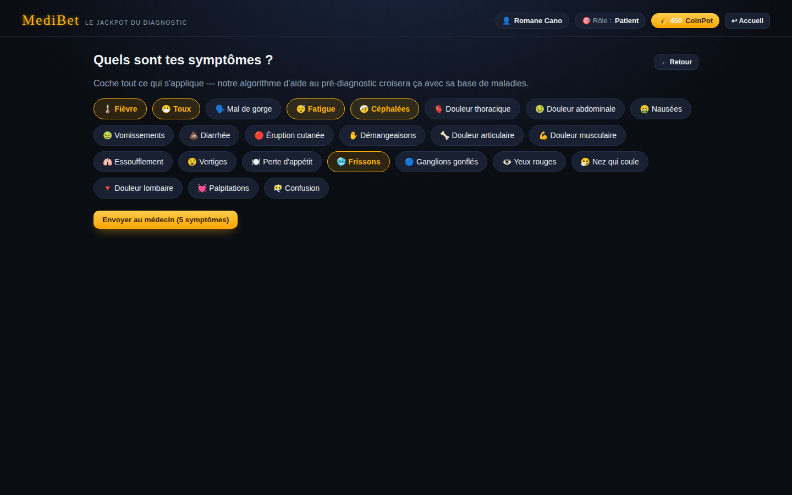

## 4. Patient — dossier et pari
[`03-patient-dossier-pari.html`](03-patient-dossier-pari.html)
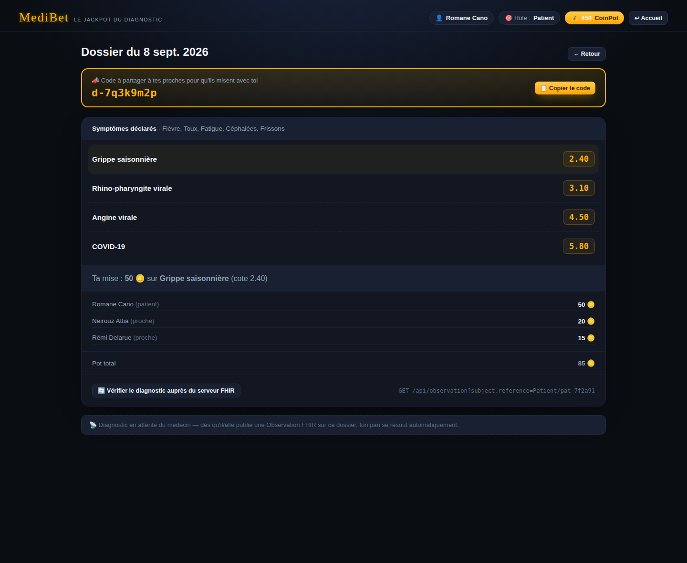

## 5. Proche — rejoindre un pari
[`04-proche-rejoindre.html`](04-proche-rejoindre.html)
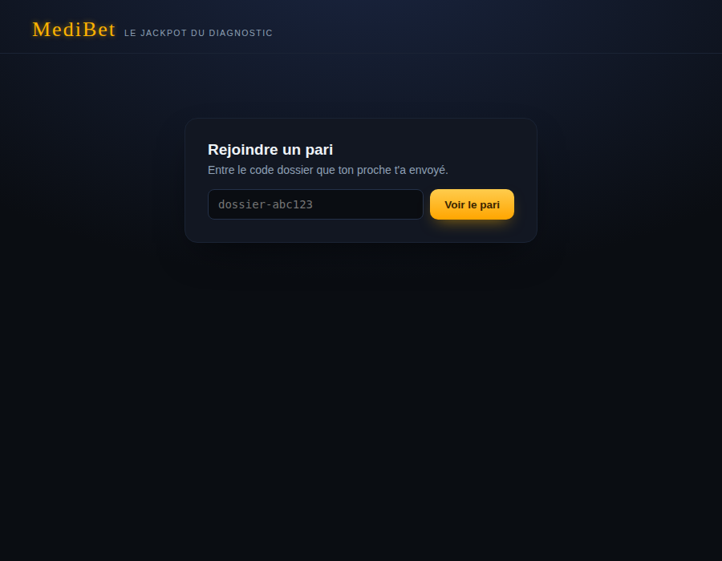

## 6. Classement des patients
[`05-classement-patients.html`](05-classement-patients.html)
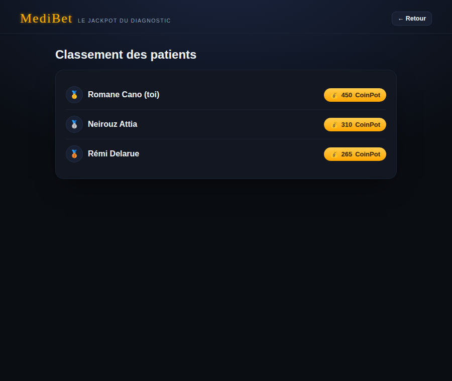

## 7. Médecin — dossiers en attente + diagnostic officiel
[`06-medecin-dossiers-diagnostic.html`](06-medecin-dossiers-diagnostic.html)
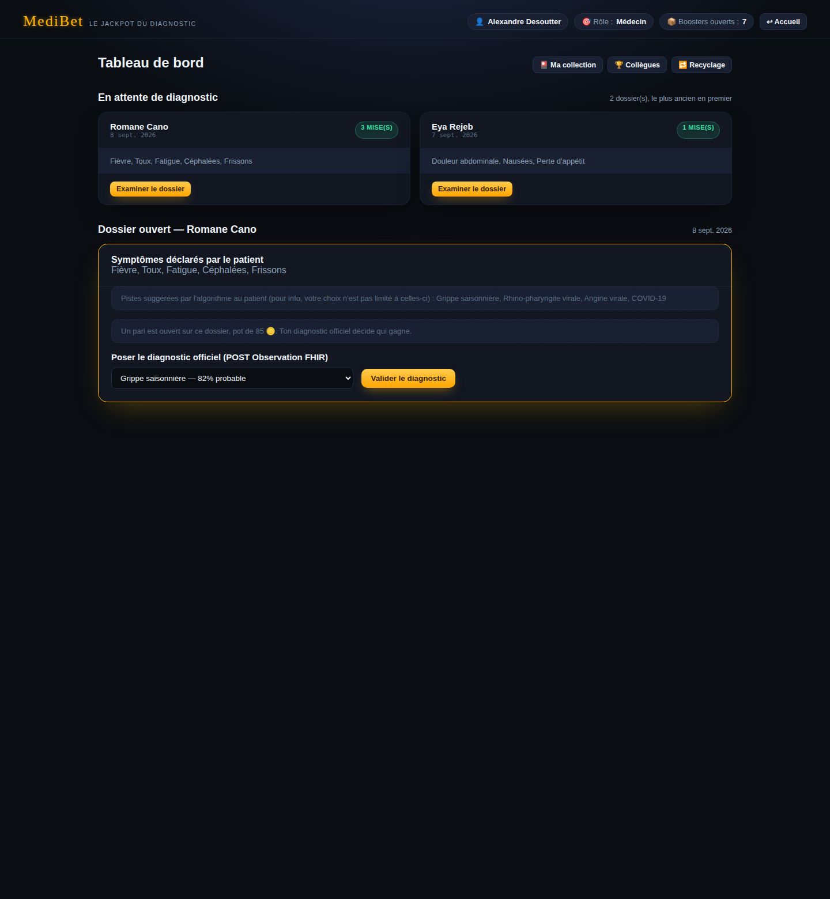

## 8. Résultat du pari + booster
[`07-resultat-booster.html`](07-resultat-booster.html)
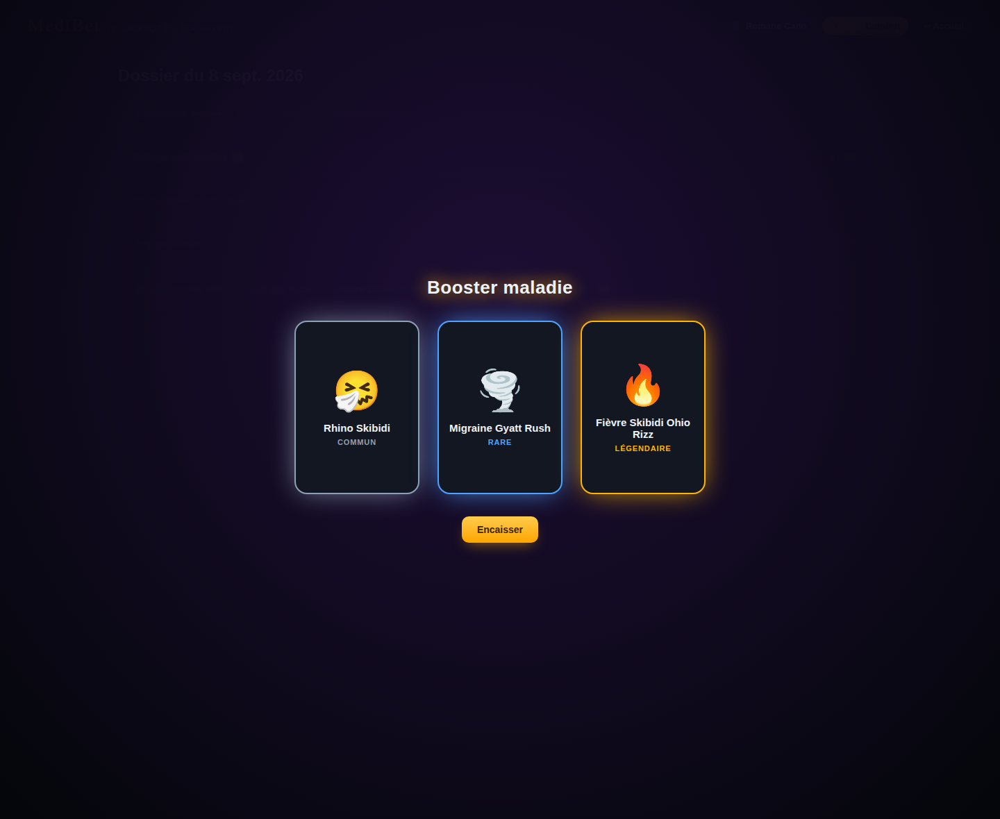

## 9. Collection de cartes maladies
[`08-collection-cartes.html`](08-collection-cartes.html)
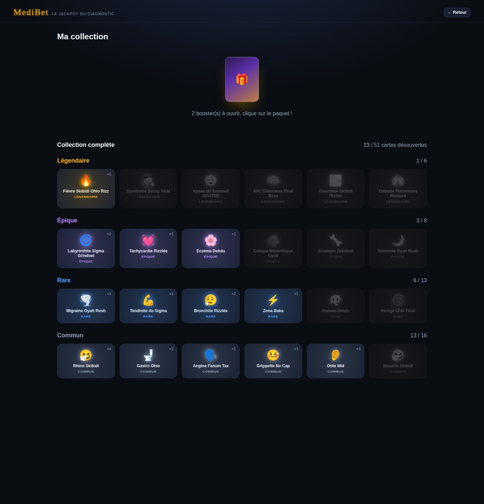

## 10. Atelier de recyclage des cartes
[`09-recyclage-cartes.html`](09-recyclage-cartes.html)
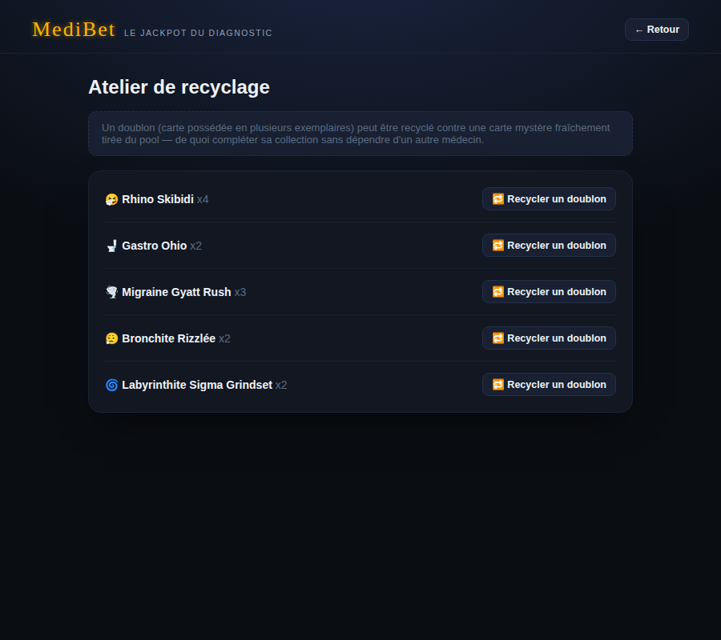

## 11. Classement des collègues (médecins)
[`10-classement-medecins.html`](10-classement-medecins.html)
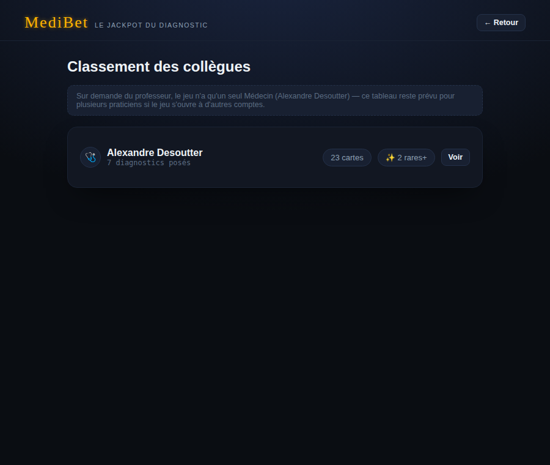

## 12. Console FHIR
[`11-console-fhir.html`](11-console-fhir.html)
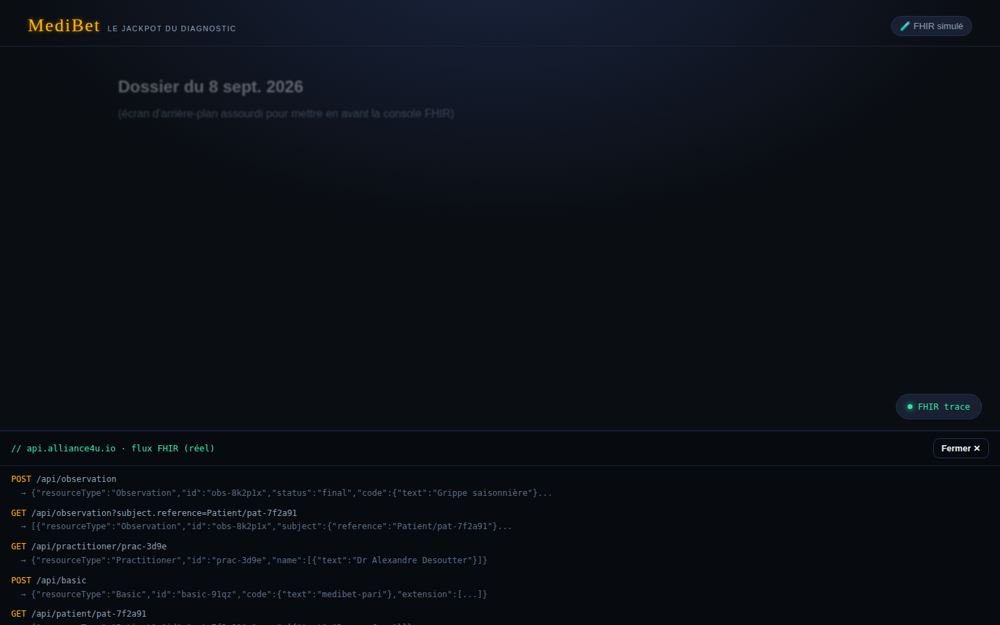

---

Version éditable (canvas multi-écrans, export PNG/PDF) :
https://claude.ai/code/artifact/0476cf8c-be58-459f-a054-b600b4afc786
